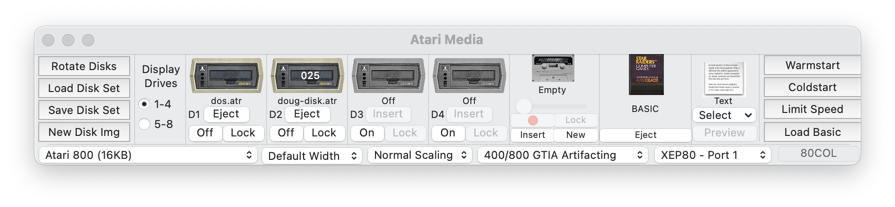
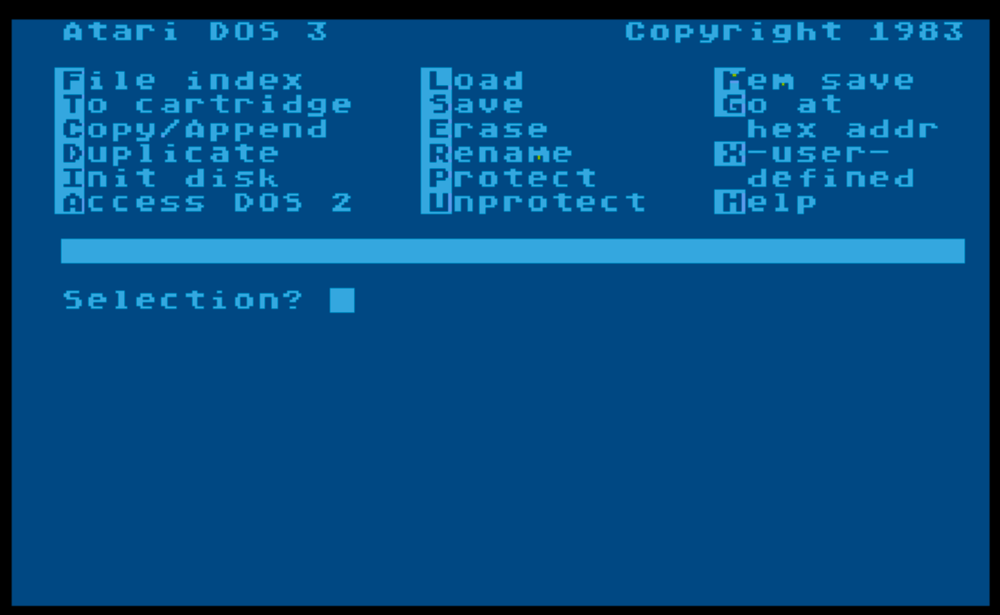
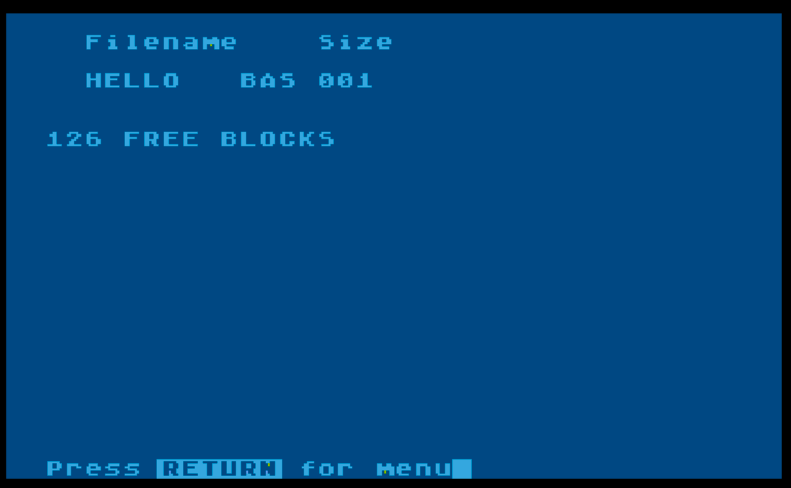

# Atari BASIC

## Introduction

This page documents how I got the Atari 800 emulator working as part of 
my research into recreating the first real computer program I wrote
back in the early 80s (see [../README.md](../README.md) for details).

I also explain a bit of BASIC code I wrote exploring string manipulation.

## Docs

* [Atari DOS](https://www.atariarchives.org/creativeatari/Atari_DOS.php) - Reference
* [Atari reference manuals](http://www.atarimania.com/documents-atari-400-800-xl-xe-manuals_2_8.html) - BASIC manual found here

## Emulator

I used the [Atari800MacX Emulator](http://atarimac.com/atari800macx.php) for
my research.  I put the downloaded application in my local `~/Applications` folder.

The Media window is helpful for disk image stuff, warm & cold starts, and loading `BASIC`.



Click **Load Basic** to start the `BASIC` editor.

## Editor Hints

* Use `CTRL-ARROWS` to move cursor around (you may need to disable existing Mac keyboard
  shortcuts related to Mission Control)
* `Option-F5` inserts a space
* `Option-F7` clears the screen

## String Array Processing

Researching my blog post, I was most curious about how I had 
handled inputting all those words from the dictionary

Atari BASIC doesn't have native arrays of strings, but various contemporaneous 
articles I found via Google and the Bubble Sort example in the BASIC manual 
helped me figure out you can simulate them by shoving all of your data into 
one big string and access elements via substring indexing.

The other related problem was reading in an unknown quantity of words, 
which I solved via a generous allocation to the one-big-string combined 
with using the `READ` and `DATA` commands until detecting the end of data 
via the `_END_` tombstone.

The actual working code below puts these concepts together. Essentially, I 
reserve space for one thousand words and then use a loop over `DATA` commands 
to add 5-letter words to a slot in the `WORDS$` string.

Click **Load Basic** in the emulator, then paste this code 
in and type `RUN` to run the program or `LIST` to verify/review the listing.

```text                                 
25 DIM WORDS$(5*1000)
50 DIM A$(5)
100 FOR D=0 TO 999
200 READ A$
250 IF A$="_END_" THEN GOTO 1010
300 PRINT "READ ",A$
350 WORDS$(D*5+1,D*5+1+5)=A$
400 NEXT D
510 DATA BABEL,BABES,BACKS,BACON
520 DATA BADDY,BADGE,BADLY,BAGEL
530 DATA BAGGY,BAHTS,BAILS,BAIRN
540 DATA BAITS,BAIZE,BAKED,BAKER
550 DATA BAKES,BALDS,BALDY,BALED
1000 DATA _END_
1010 PRINT "--DONE--"
1040 PRINT "WORD",WORDS$                                                
```

## DOS and Disks

I didn't have a floppy disk drive for my Atari 800, but I found it
useful to have one to be able to save code (it seems easier in the
emulator than the cassette tape system). In order to save a program to 
disk, you need Atari DOS to format a disk.

You can use this [Atari DOS](https://winworldpc.com/product/atari-dos/3x) image.

It’s in 7zip format, so did this to extract on my Mac:

```shell
brew install 7zip
mkdir ~/Downloads/Atari-DOS
cd !$
wget -O atari-dos.7z \
https://winworldpc.com/download/46e282ac-7f53-c2b2-3711-c3a5c28f1352/from/c39ac2af-c381-c2bf-1b25-11c3a4e284a2
7zz e atari-dos.7z
cp disk01.atr ~/Applications/Atari800MacX/Disks/dos.atr
```

## Saving To Disk

In order to save program code to disk, you need to format an emulated floppy disk.

First, using the Media window, turn on Disk 1 (aka `D1`) and insert `dos.atr`.
Then click on **Coldstart** to load the DOS from Disk 1.  You'll see this menu:



You need to create a new single-density disk image (e.g., `doug-disk.atr`) via the 
Media window's **New Disk Img** button.  Then turn on Disk 2 (aka `D2`) and 
insert the image you just created.

It is helpful to **Save Disk Set** (ROM/D2 disk) so can reload 
upon restart.  I called this `dos-doug-disk.set`.

Back in the DOS menu, format the new disk image:

* `I` for **Init Disk**, then `2` for Disk 2.  
* Format type: `2` for double density.  
* `N` to **Write FMS.SYS** question.
* `RETURN` to init and then `ESC` to return to menu.

Then click **Load Basic** button to load `BASIC`.

Back in `BASIC` again, type a simple program:

```text
10 PRINT "HELLO DOUG"
20 GOTO 10
RUN
```

Click the tilde `~` key to stop program.

Save it to disk via:

```text
SAVE "D2:HELLO.BAS"
```

Verify it is on disk by running `DOS` again,

```text
DOS
F(ile index)
Filespec: D2:*.*
Display Device: E:
```

This shows:



`T` for back **T**o cartridge (BASIC).

```text
LOAD "D2:HELLO.BAS"
LIST
```

Starting from fresh restart of emulator:

* Load disk set `dos-doug-disk.set`
* Click **Load Basic**

Load program and run it:

```text
LOAD "D2:HELLO.BAS"`
LIST
RUN
```

Once again `~` will stop a running program.
